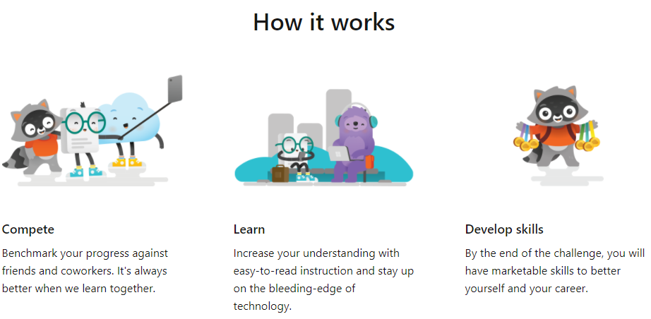
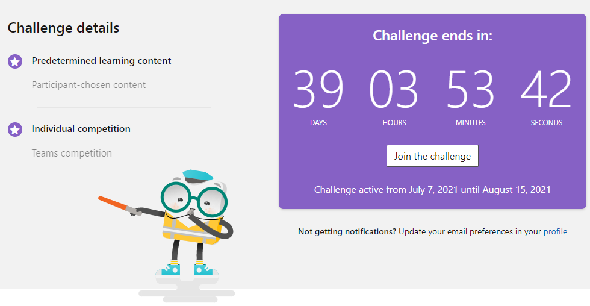
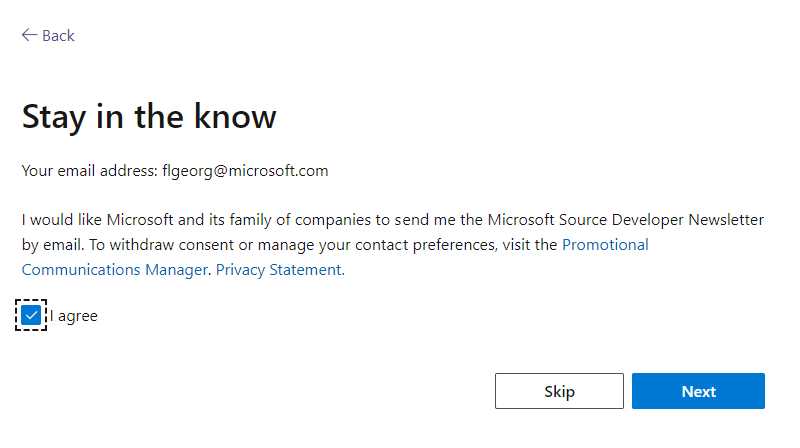
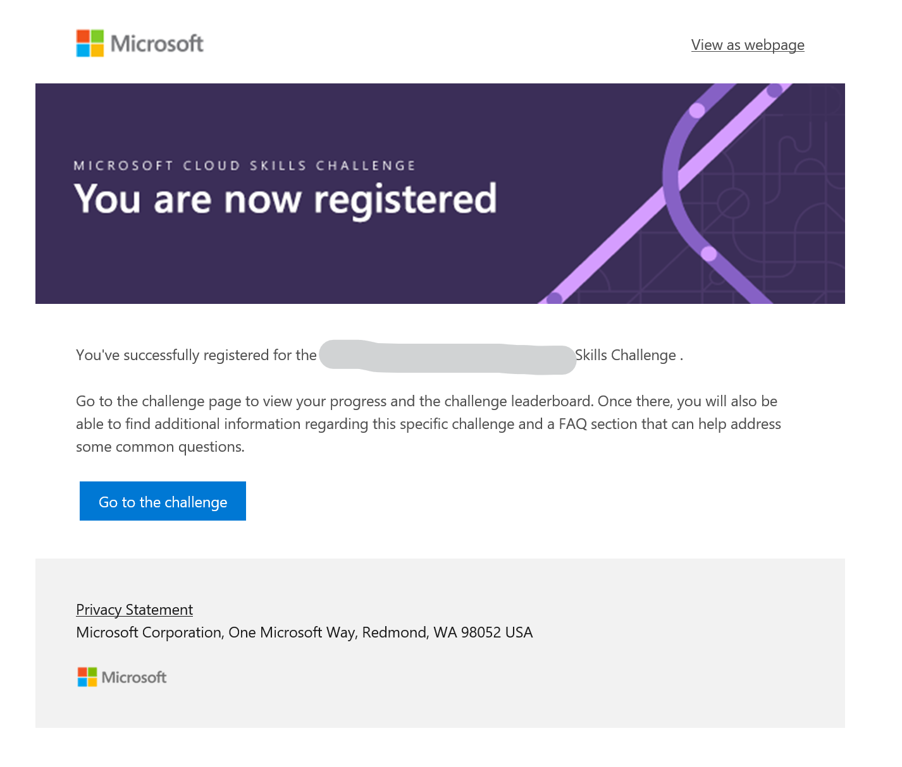
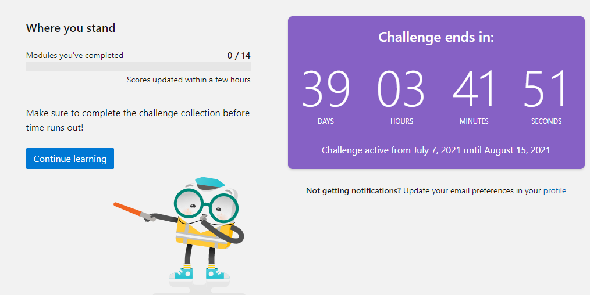
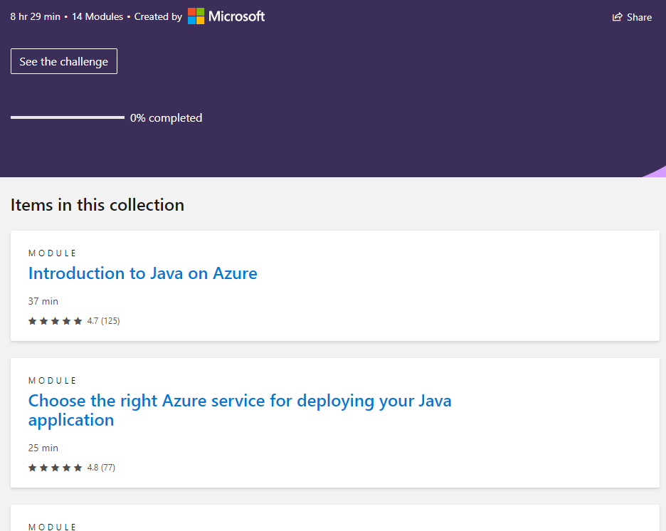
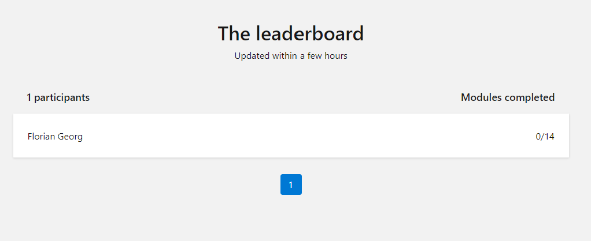

# How to join the Cloud Skills Challenge

Cloud Skills Challenges are timeboxed, self-learning opportunities
along technical learning content we selected for you. 
It's all done on Microsoft Learn https://learn.microsoft.com/.

You'll need to login with your Microsoft ID in order to participate and track your progress.
Some hands-on tutorials will launch a Sandbox directly in your browser. If you encourage problems with that, let us know, and we might find an alternative way for you to try things out.

## STEP 1: Join the Challenge Page
On the challenge page at https://aka.ms/UBS/JavaOnAzureChallenge
you'll see the starting portal. It'll show you some info around the challenge type, and how long it is still running. 
Please click on "Join the Challenge"

## STEP 2: Share your contact with us
Please consider signing up to our ``Microsoft.Source`` newsletter.
This also makes it easier for us to contact you in the future about relevant stuff (no spam).

You'll receive a welcome e-mail shortly after. It looks like this:

### STEP 3: Continue Learning
Now you can come back at any time to the Challenge Dashboard, and continue learning:

The dasboard page also shows you the remaining time of the challenge, how much you have already completed or learned, and a leaderboard:

For our challenge, the leaderboard will show how many of the selected modules have been completed already, and how your peers perform.

## STEP 4: End of challenge

This particular challenge ends **August 15th 2021 12:59:59 CET**.

Please check the leaderboards and if you see your alias amongst the top (e.g. completed all / most of the modules), please reach out to the event organizers on how to claim your rewards.

Thanks for being awesome, and we hope you find our skilling content valuable :)

